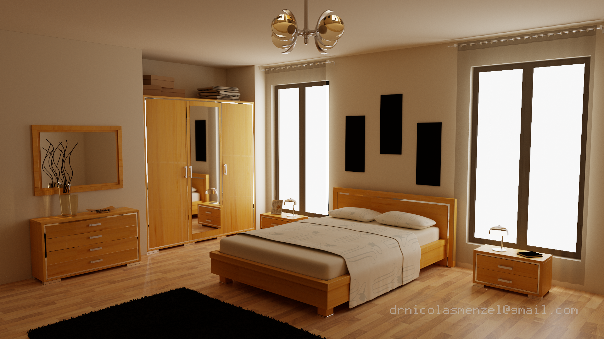
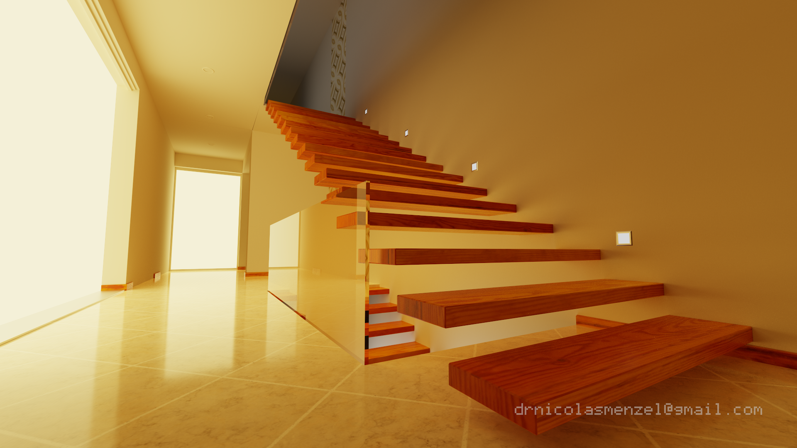
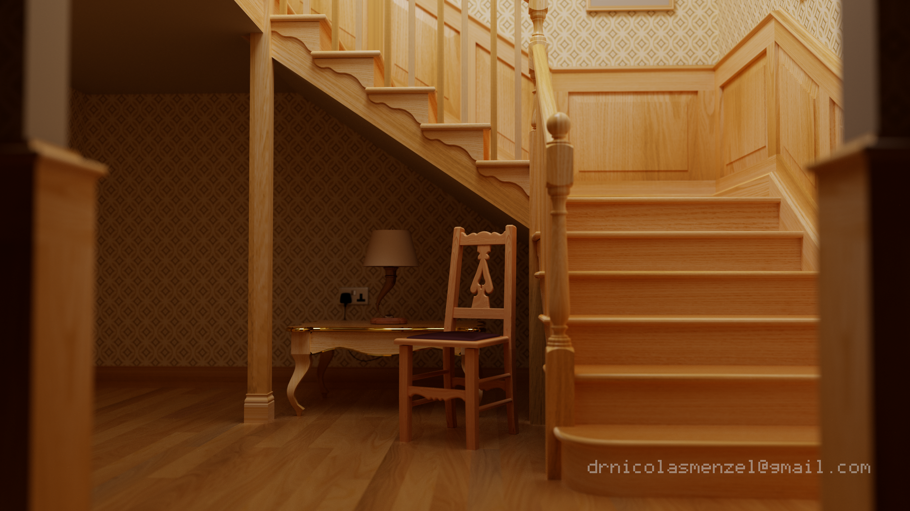
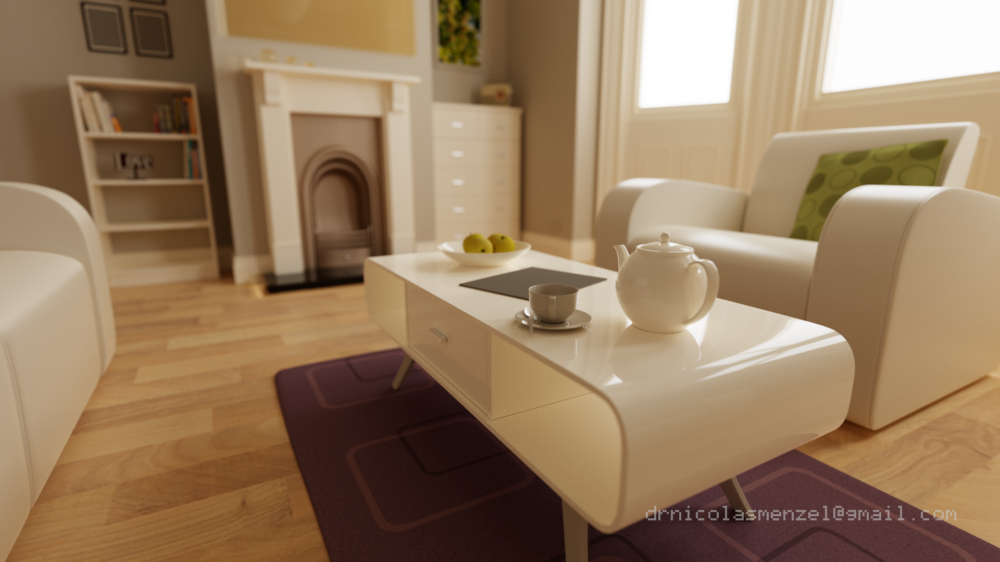
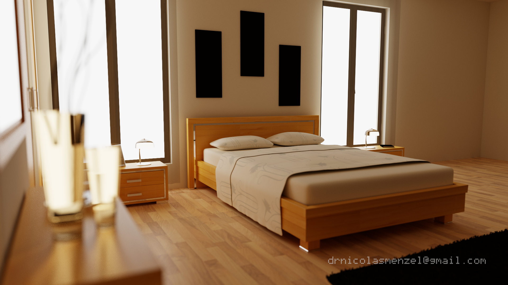

<h1 align="center">Spectral Photon-Guided Path Tracer</h1>

<p align="center">
  
</p>
<p align="center">
  
  
</p>
<p align="center">
  
  
</p>
<p align="center">
  
  
</p>

<p align="center"><sub>
  Scenes from <a href="https://benedikt-bitterli.me/resources/">Rendering resources</a> by Benedikt Bitterli (2016).
  Original scene geometry and materials by their respective authors — see <a href="#third-party-scene-credits">credits</a>.
</sub></p>

<p align="center">
  A physically-based GPU renderer that combines <b>photon mapping</b> with
  <b>full camera path tracing</b> via a <b>photon-guided directional sidecar</b> —
  all computed over 4 discrete spectral wavelength bins with no RGB
  approximations in the transport.
</p>

<p align="center">
  Built on <b>NVIDIA OptiX 9</b> · <b>CUDA 12</b> · <b>C++17</b>
</p>

<p align="center">
  <a href="#the-hybrid-approach">Hybrid Approach</a> •
  <a href="#physics">Physics</a> •
  <a href="#key-features">Features</a> •
  <a href="#pipeline">Pipeline</a> •
  <a href="#architecture">Architecture</a> •
  <a href="#build">Build</a> •
  <a href="#tests">Tests</a> •
  <a href="#license">License</a>
</p>

---

## The Hybrid Approach

Most physically-based renderers fall into one of two camps: **pure path
tracers** that integrate all transport along camera rays, or **photon
mappers** that precompute a global irradiance field from the light side.
This renderer takes a **hybrid** path that combines the strengths of both:

1. **Photon pass (light-side).** Photon rays start from emitters, bounce
   through the scene with full BSDF importance sampling and Russian
   roulette, and deposit spectral flux packets at diffuse surfaces.
   A separate caustic pass uses targeted two-point emission toward
   specular geometry. The result is a view-independent photon map that
   can be computed once, saved to disk, and reused across camera positions.

2. **Camera pass (eye-side).** Each pixel fires a full iterative path
   tracer. At every non-delta bounce the renderer evaluates
   **next-event estimation** (NEE) for direct lighting and fires a
   **guided sub-path sidecar** — a secondary ray whose direction is
   drawn from photon incident directions stored in a dense spatial grid.
   The sidecar returns irradiance that is MIS-combined with the BSDF
   continuation. Camera rays are therefore never limited to a single
   diffuse hit; they trace full specular chains, glossy reflections,
   and multi-bounce diffuse paths.

3. **Direction map.** Per-pixel guidance precomputed from photon flux.
   A kNN gather of nearby photons builds a 128-bin Fibonacci-sphere
   directional histogram. Shadow rays filter occluded contributions and
   up-weight paths through glass and mirrors. The resulting guided
   direction is sampled via one-sample MIS (balance heuristic, 50/50
   BSDF vs guided) — steering camera bounces toward regions the photon
   map has already explored.

This hybrid design provides **fast convergence in difficult light paths**
(caustics, indirect illumination through glass, multi-bounce diffuse) while
retaining the **full generality of camera-side path tracing** for specular
chains, glossy reflections, and fine geometric detail.

> *Example — sunlight entering a room through a small window, bouncing
> off a bright wall, and illuminating the ceiling two bounces away.
> A pure path tracer struggles because the probability of a random camera
> ray finding that narrow light path is tiny — most samples return black,
> and the image stays noisy for thousands of samples. Here the photon
> pass floods the room with photons from the window in a single pre-pass;
> the direction map then tells every ceiling pixel "light arrives from the
> wall over there," and the camera path tracer sends its guided sidecar
> in that direction on the very first frame.*

---

## Physics

All light transport is spectral. The renderer discretises the visible
spectrum (380–780 nm) into `NUM_LAMBDA = 4` bins at 100 nm intervals
(centres at 430, 530, 630, 730 nm). Each photon carries 4 stratified
hero wavelengths. Spectral bins never
mix during transport; conversion to display colour happens only at output.

### Rendering Equation

The pixel radiance is the standard rendering equation integrated over the
hemisphere at each surface point:

$$L_o(x, \omega_o) \;=\; L_e(x, \omega_o) \;+\; \int_{\mathcal{H}^2} f_r(x, \omega_i, \omega_o)\; L_i(x, \omega_i)\; |\cos\theta_i|\; \mathrm{d}\omega_i$$

The renderer evaluates this integral in two parts:

- **Direct term** — estimated via NEE with a shadow ray to an emitter
  sampled from a power-weighted alias table.
- **Indirect term** — estimated via the photon-guided sidecar, where the
  photon map provides a low-variance directional importance function.

### Photon Density Estimation

Indirect irradiance at a surface point $x$ is estimated from
the $k$ nearest photons using an **Epanechnikov kernel** over a **tangential
disk**:

$$E(x) \;\approx\; \frac{1}{N_{\text{emitted}}} \sum_{p=1}^{k} \frac{\Phi_p \cdot K\!\bigl(d_{\!\perp}(x, x_p) \,/\, r_k\bigr)}{\pi\, r_k^2 / 2}$$

where $d_{\!\perp}$ is the distance projected onto the tangent plane
of the query normal and $K(u) = \max(0,\; 1 - u^2)$ is the Epanechnikov
kernel. This 2D tangential metric eliminates the cross-surface light
leakage inherent in 3D spherical gather kernels.

### Dispersion

Glass materials use the **Cauchy dispersion model** with per-wavelength
refractive index:

$$n(\lambda) = A + \frac{B}{\lambda^2}$$

Each hero wavelength refracts independently, producing physically correct
chromatic dispersion with per-bin Fresnel weighting and per-wavelength
total internal reflection checks.

### Adjoint Correction

At refractive interfaces the solid angle changes, requiring an
$\eta^2$ correction for photon (importance) transport:

$$\Phi' = \Phi \cdot T_f \cdot \left(\frac{\eta_i}{\eta_t}\right)^{\!2}$$

The renderer tags every ray with a `TransportMode` (Radiance or
Importance) and applies this correction per wavelength bin when
dispersion is active.

### Spectral Output Pipeline

$$\text{Spectrum} \;\xrightarrow{\text{CIE}}\; \text{XYZ} \;\xrightarrow{D_{65}}\; \text{linear sRGB} \;\xrightarrow{\text{ACES Filmic}}\; \text{sRGB gamma}$$

CIE XYZ colour matching uses Gaussian fits from Wyman et al. (2013). ACES
filmic tone mapping follows Narkowicz (2015).

---

## Key Features

### Photon Mapping

| Property | Detail |
|---|---|
| **Photon structure** | Position, incident direction, geometric normal, full spectral flux (4 bins), hero wavelengths, path flags |
| **Spatial index** | KD-tree (CPU reference, median-split), Teschner hash grid (GPU primary, O(1) build) |
| **Gather kernel** | Tangential disk with Epanechnikov weighting — 2D surface distance, no cross-surface leakage |
| **Adaptive radius** | Per-cell k-NN (k=100) from CellInfoCache photon density |
| **Surface filter** | Plane-distance consistency (τ = 0.05) rejects photons from adjacent walls |
| **Caustic map** | Separate caustic photon map with targeted two-point specular emission |
| **Path flags** | Per-photon tagging: traversed glass, caustic glass, volume scatter, dispersion, caustic specular |
| **Photon map pool** | Pre-built maps cycled during accumulation (no re-tracing during render) |

### Direction Map (Photon-Guided Path Tracing)

The direction map is the core mechanism that connects the photon pass to
the camera pass:

1. **Build.** For each pixel, a kNN gather (k=64) of nearby photons
   collects their incident directions. Shadow rays from the hit point
   toward each photon classify occlusion: unobstructed photons have
   default weight, paths through glass or mirrors are up-weighted (4×).
   The weighted directions are binned into a **128-bin Fibonacci-sphere
   histogram** with Epanechnikov angular weighting.

2. **Sample.** During camera path tracing, at each non-delta bounce the
   renderer samples a guided direction from the histogram via inverse-CDF
   with angular jitter (jitter scale = 0.3).

3. **MIS.** The guided sample is combined with the BSDF sample using
   one-sample balance heuristic (50% guide / 50% BSDF). This ensures
   the estimator remains unbiased while focusing samples toward
   photon-explored directions.

4. **GPU implementation.** On the GPU, per-cell Fibonacci-sphere bins
   (32 bins, ≈ 0.39 sr each) from the CellBinGrid are loaded into
   thread-local histograms. Sampling uses the same inverse-CDF approach
   with a hemisphere gate that flips directions to match the surface
   normal.

> *Example — a glossy hardwood floor reflecting a bright window.
> Without the direction map, the camera path tracer importance-samples
> the GGX lobe uniformly; most samples miss the small window and return
> only dim indirect light, producing slow, noisy convergence on the
> reflection. With the direction map, nearby photons that arrived from
> the window populate a directional histogram pointing straight at it.
> The guided sidecar fires toward the window on 50% of samples,
> resolving the bright glossy reflection in a fraction of the samples.*

### Spectral Outlier Clamp

High-variance spectral fireflies are suppressed by a **photon-referenced
per-wavelength clamp**: the low-variance photon irradiance estimate at each
pixel provides a reference value; path tracing samples exceeding
`20× reference` per wavelength bin are clamped. This preserves correct
colour balance (no RGB channel mixing) while eliminating outliers that would
otherwise require orders of magnitude more samples to average out. The clamp
is disabled in preview mode and can be toggled at runtime.

### Targeted Caustic Emission

Standard photon tracing produces sparse caustic illumination because few
random photons hit small specular objects. The renderer supplements this
with **targeted two-point caustic sampling**:

- An area-weighted alias table over all specular (glass/mirror) triangles
  selects a target surface point.
- A photon ray is generated from the nearest emitter aimed directly at
  the specular target.
- Visibility and backface checks ensure physical validity; transparent
  blockers are allowed to pass through.

> *Example — a small glass diamond sitting on a table under an area
> light. Standard photon tracing sends millions of photons into the
> scene uniformly; only a handful happen to hit the diamond, refract
> through it, and project a caustic pattern on the table — leaving the
> caustic dim and speckled. Targeted emission picks the diamond's
> triangles from the alias table, aims photons directly at them from
> the light source, and produces a sharp, well-resolved caustic with
> the same total photon budget.*

### Additional Features

| Feature | Detail |
|---|---|
| **Chromatic dispersion** | Cauchy model, per-bin IOR, per-wavelength TIR checks |
| **Glass colour** | Spectral transmittance filter (Tf) + direct per-bin override (`pb_tf_spectrum`) |
| **Adjoint η² correction** | TransportMode tagging at every refractive interface |
| **BSDF models** | Lambertian, perfect mirror, dielectric glass (Fresnel + Cauchy), GGX microfacet (VNDF sampling) |
| **NEE** | Coverage-aware stratified area sampling with power-weighted alias table |
| **Adaptive sampling** | Per-pixel convergence mask based on spectral variance |
| **Depth of field** | Thin-lens model with configurable aperture and auto-focus |
| **Denoiser** | OptiX AI denoiser with albedo + normal guide layers |
| **CPU reference** | Physically identical dual CPU/GPU implementation, verified via PSNR (direct > 40 dB, indirect > 30 dB, energy ≤ 5%) |
| **CellInfoCache** | 64K-entry hash table with per-cell irradiance, variance, density, directional spread, caustic statistics, adaptive radius |

---

## Pipeline

```
PHOTON PASS  ── compute once, reuse across camera views ─────────
  ┌───────────────────────────────────────────────────────────────┐
  │  Emit N photons from lights (power-proportional sampling)     │
  │  Per photon (4 hero wavelengths):                             │
  │    Bounce 0: cosine-weighted hemisphere from emitter          │
  │    Bounce 1+: BSDF importance sampling + Russian roulette     │
  │    Glass: Cauchy dispersion, Tf filter, IOR stack, path flags │
  │    Deposit flux at each diffuse hit (lightPathDepth ≥ 2)      │
  │    Separate global map (diffuse) vs caustic map (specular)    │
  │  Build spatial index: hash grid (GPU)         │
  │  Build CellInfoCache (per-cell density, variance, caustics)   │
  │  Targeted caustic emission toward specular geometry            │
  │  Build directional histograms (CellBinGrid, 32 Fibonacci      │
  │    bins per cell) for photon-guided path tracing               │
  └───────────────────────────────────────────────────────────────┘
                              │
                              ▼
DIRECTION MAP  ── per-pixel guidance from photon flux ────────────
  ┌───────────────────────────────────────────────────────────────┐
  │  kNN gather (k=64) of nearby photons per pixel                │
  │  Shadow-ray filter: classify glass/mirror/opaque occluders    │
  │  128-bin Fibonacci-sphere histogram (Epanechnikov kernel)     │
  │  Per-pixel guided direction + PDF for MIS                     │
  └───────────────────────────────────────────────────────────────┘
                              │
                              ▼
CAMERA PASS  ── per frame, full iterative path tracing ───────────
  ┌───────────────────────────────────────────────────────────────┐
  │  For each pixel (stratified jittered sub-pixel samples):      │
  │    Trace camera ray → follow specular chain (≤ 12 bounces)    │
  │    At each non-delta bounce:                                  │
  │      NEE: shadow ray to power-weighted emitter sample         │
  │      Guided sidecar: direction from photon histogram (MIS)    │
  │      BSDF continuation: importance-sampled next bounce        │
  │    Russian roulette terminates low-throughput paths            │
  │    Spectral outlier clamp (photon-referenced, per-bin)        │
  └───────────────────────────────────────────────────────────────┘
                              │
                              ▼
OUTPUT
  ┌───────────────────────────────────────────────────────────────┐
  │  OptiX AI Denoiser (optional, albedo + normal guide layers)   │
  │  Spectral → CIE XYZ → linear sRGB → ACES Filmic → gamma     │
  └───────────────────────────────────────────────────────────────┘
```

---

## Architecture

Full architecture documentation:
[doc/architecture/Architecture.md](doc/architecture/Architecture.md)

### Key Design Decisions

| Decision | Detail |
|---|---|
| **Hybrid photon-guided PT** | Photon map seeds a directional guide; camera rays run full iterative path tracing with guided sidecar |
| **Full spectral** | 4 wavelength bins (380–780 nm), no RGB anywhere in transport; hero wavelength system (4 bins/photon) |
| **Direction map** | Per-pixel 128-bin Fibonacci-sphere histogram from photon kNN; MIS-combined with BSDF at every non-delta bounce |
| **Tangential disk kernel** | 2D surface-distance gather; eliminates cross-surface leakage and planar blocking |
| **Spectral outlier clamp** | Per-wavelength-bin clamp referenced to low-variance photon irradiance; preserves colour balance |
| **Adjoint-correct transport** | TransportMode tag (Radiance/Importance) with η² correction at refractive interfaces |
| **Dual CPU/GPU** | CPU reference for ground truth; GPU (OptiX + CUDA) for speed; integration tests verify parity |

### Project Layout

```
src/
  main.cpp                       Entry point, CLI, GLFW loop
  app/
    viewer.h / .cpp              GLFW window, event loop, overlays
  core/
    config.h                     Tunable constants, scene profiles
    types.h                      Vec3, Ray, HitRecord, ONB
    spectrum.h                   Spectral arithmetic, CIE XYZ
    random.h                     PCG RNG
    alias_table.h                O(1) alias sampling
    cell_cache.h                 CellInfoCache — per-cell statistics
  bsdf/
    bsdf.h                       Lambertian, mirror, glass, GGX VNDF
  scene/
    scene.h                      Scene graph, emitter list, BVH
    material.h                   Material types + Cauchy dispersion
    obj_loader.h / .cpp          Wavefront OBJ + MTL parser
  renderer/
    renderer.h / .cpp            CPU reference renderer
    camera.h                     Perspective camera, thin-lens DoF
    path_trace.h                 Camera-side path tracing logic
  photon/
    photon.h                     Photon struct (SoA), hero wavelengths
    kd_tree.h                    KD-tree build + k-NN (CPU)
    hash_grid.h / .cu            Hash grid build + query (GPU)
    density_estimator.h          Tangential disk kernel
    surface_filter.h             Surface consistency filter
    cell_bin_grid.h              Per-cell directional histograms
    direction_map.h / .cpp       Per-pixel photon-guided direction map
    specular_target.h            Targeted caustic two-point emission
    photon_io.h / .cpp           Binary photon map save/load
  optix/
    optix_renderer.h / .cpp      Host pipeline: SBT, GAS, launch params
    optix_device.cu              OptiX raygen / closesthit programs
    optix_guided.cuh             Photon-guided direction sampling (MIS)
    launch_params.h              Shared GPU/CPU launch parameter struct
    adaptive_sampling.h / .cu    Per-pixel convergence mask
  debug/
    debug.h                      Visualisation overlays
tests/                           ~340 GoogleTest unit + integration tests
scenes/                          OBJ / MTL scene files
```

---

## Requirements

| Component | Minimum | Notes |
|---|---|---|
| NVIDIA GPU | Turing (sm_75) or newer | Required for OptiX |
| CUDA Toolkit | 12.x | |
| NVIDIA OptiX SDK | 9.x | `OptiX_INSTALL_DIR` env var must be set |
| CMake | 3.24+ | |
| C++ Standard | C++17 | |
| MSVC | Visual Studio 2022 | |
| OS | Windows 10+ | |

## Build

```bat
:: 1. Set OptiX SDK path
set OptiX_INSTALL_DIR=C:\ProgramData\NVIDIA Corporation\OptiX SDK 9.1.0

:: 2. Build and run
run.bat build          :: Configure + Release build (Ninja, auto-detects MSVC)
run.bat                :: Build + launch viewer
run.bat test           :: Build + run fast tests
run.bat test-all       :: Build + run full test suite
```

Or manually:

```bat
cmake -B build -G Ninja -DCMAKE_BUILD_TYPE=Release
cmake --build build
build\photon_tracer.exe
```

---

## Tests

~340 unit and integration tests via GoogleTest.

```bat
run.bat test              :: Fast tests (skip integration / speed / GPU parity)
run.bat test-all          :: Full suite
```

| Area | Coverage |
|---|---|
| Spectral | Arithmetic, CIE XYZ colour matching, blackbody |
| BSDF | Fresnel, GGX VNDF, reciprocity, energy conservation |
| KD-tree / hash grid | Build, range query, k-NN, boundary cases, Epanechnikov kernel |
| Tangential kernel | Distance matches analytic for coplanar geometry |
| Surface filter | Cross-wall rejection, same-surface acceptance |
| Photon flags | Path flag tagging: glass, caustic, dispersion |
| CellInfoCache | Build, query, adaptive radius, hotspot detection |
| Dispersion | Cauchy IOR, per-bin Fresnel, spectral splitting |
| IOR stack | Push/pop/overflow, nested dielectric tracking |
| CPU ↔ GPU parity | Direct PSNR > 40 dB; indirect PSNR > 30 dB; energy ≤ 5% |

---

## License

MIT — see [LICENSE](LICENSE).

Copyright © 2026 nicolasgfx
