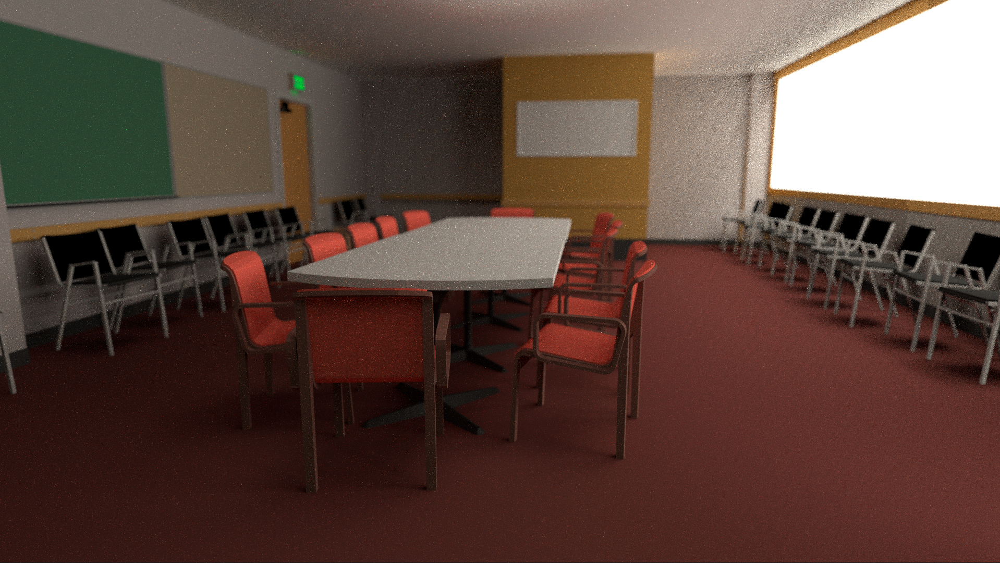

# Spectral Photon + Path Tracing Renderer

A physically-based spectral renderer combining **photon mapping** and
**path tracing**, running entirely on the GPU via **NVIDIA OptiX** and
**CUDA**.


<!-- Replace the image above with an actual render once available -->

---

## Features

- **Full spectral transport** -- 32 wavelength bins (380--780 nm), no
  RGB shortcuts in light transport
- **GPU photon tracing** -- photon emission, scattering, and storage
  via OptiX raygen programs
- **GPU path tracing** -- multi-bounce path tracing with
  next-event estimation and photon density estimation
- **Interactive debug viewer** -- real-time first-hit rendering with
  normals, material ID, and depth visualisation modes
- **Hashed uniform grid** -- fast photon lookup with Epanechnikov
  kernel and surface consistency filtering
- **Material system in codebase** -- Lambertian, mirror, glass,
  GlossyMetal definitions are present; current OptiX runtime path
  focuses on Lambertian + mirror-style specular reflections
- **Comprehensive test suite** -- 152 unit tests covering all core
  components

### Runtime scope (current OptiX path)

- Direct lighting: NEE with shadow rays
- Indirect lighting: photon density estimation (single photon map)
- Component outputs: `out_nee_direct.png`, `out_photon_indirect.png`,
  `out_combined.png`
- Debug caustic toggle exists, but a separate caustic photon map/output
  is not implemented yet

---

## Requirements

| Component            | Minimum Version                   |
|----------------------|-----------------------------------|
| **NVIDIA GPU**       | Turing architecture (sm_75) or newer |
| **CUDA Toolkit**     | 12.x                             |
| **NVIDIA OptiX SDK** | 7.x or 9.x                       |
| **CMake**            | 3.24                              |
| **C++ Standard**     | C++17                             |
| **OS**               | Windows 10+ (MSVC 2022) or Linux  |

> **OptiX is mandatory.** There is no CPU fallback. The build will
> fail if `OptiX_INSTALL_DIR` is not set.

---

## Build

### 1. Set the OptiX SDK path

```bash
# Environment variable (recommended)
set OptiX_INSTALL_DIR=C:\ProgramData\NVIDIA Corporation\OptiX SDK 9.1.0

# Or pass directly to CMake
cmake -B build -DOptiX_INSTALL_DIR="C:\ProgramData\NVIDIA Corporation\OptiX SDK 9.1.0"
```

### 2. Configure and build

```bash
cmake -B build
cmake --build build --config Debug
```

### 3. Run

```bash
# Interactive debug viewer (default scene: Cornell box)
build\Debug\photon_tracer.exe

# Custom scene with options
build\Debug\photon_tracer.exe scenes/my_scene.obj --spp 64 --photons 1000000
```

### Quick script (Windows)

```bat
run.bat              # Build & run interactive viewer
run.bat test         # Build & run unit tests
run.bat release      # Build & run in Release mode
run.bat clean        # Delete build directory
```

---

## Usage

The renderer starts in an **interactive debug window**. Press keys to
switch visualisation modes and trigger the final render.

### Controls

#### Camera / window controls

| Input | Action |
|---|---|
| **W/A/S/D** | Move camera forward / left / back / right |
| **SPACE / Left Ctrl** | Move camera up / down |
| **Mouse move** | Look around (when mouse is captured) |
| **Left Shift** | Faster movement (3x speed) |
| **M** | Toggle mouse capture/release |
| **Left click** | Re-capture mouse when released |
| **ESC** or **Q** | If mouse captured: release it. If already released: quit |

#### Render controls

| Key | Action |
|---|---|
| **R** | Start full path tracing render and save PNG outputs |
| **TAB** | Cycle render mode: `Full` -> `DirectOnly` -> `IndirectOnly` -> `PhotonMap` -> `Normals` -> `MaterialID` -> `Depth` |
| **H** | Toggle help overlay |

#### Debug toggles

| Key | Action |
|---|---|
| **F1** | Toggle photon points overlay |
| **F2** | Toggle global-map overlay |
| **F3** | Toggle caustic-map selection (separate caustic map is not implemented yet) |
| **F4** | Toggle hash-grid debug flag |
| **F5** | Toggle photon-direction debug flag |
| **F6** | Toggle PDF debug flag |
| **F7** | Toggle gather-radius debug flag |
| **F8** | Toggle MIS-weight debug flag |
| **F9** | Toggle spectral coloring for photon overlay |

#### Hover-cell inspection

- Release mouse capture with **M**.
- Enable a map toggle (**F2** global or **F3** caustic selector).
- Move cursor over the image to view hover panel data:
  cell index, photon count, flux sum/avg, dominant wavelength.

### Command-Line Options

| Option         | Description                          | Default          |
|----------------|--------------------------------------|------------------|
| `--width W`    | Image width                          | 512              |
| `--height H`   | Image height                         | 512              |
| `--spp N`      | Samples per pixel (final render)     | 16               |
| `--photons N`  | Number of photons                    | 500000           |
| `--radius R`   | Photon gather radius                 | 0.05             |
| `--output FILE`| Output file path                     | output/render.png|
| `--mode MODE`  | Render mode: full, direct, indirect, photon, normals, material, depth | full |

---

## Project Structure

```
src/
  main.cpp                     Entry point, GLFW loop
  core/                        Types, spectrum, config, RNG
  bsdf/                        BSDF models (Lambertian, mirror, glass, GGX)
  scene/                       OBJ/MTL loader, scene structure, BVH
  renderer/                    CPU renderer, camera, path tracer kernels
  photon/                      Photon structures, hash grid, emitter
  optix/                       OptiX device programs and host pipeline
  debug/                       Debug visualisation state and key bindings
tests/
  test_main.cpp                152 unit tests (GoogleTest)
scenes/                        Test scenes (Cornell box, etc.)
doc/
  architecture/                Detailed architecture documentation
  prompts/                     Design specification documents
```

---

## Tests

The project includes 152 unit tests built with GoogleTest v1.14.0:

```bash
# Build and run tests
run.bat test

# Or manually
cmake --build build --config Debug
build\Debug\ppt_tests.exe
```

Test coverage includes:

- Vector math, ONB, coordinate transforms
- Spectral arithmetic, CIE colour matching, blackbody emission
- RNG distribution quality
- Cosine/uniform hemisphere sampling, triangle sampling
- MIS power heuristic (2-way and 3-way)
- Alias table construction and sampling
- Ray-triangle intersection (hit, miss, edge cases)
- AABB ray intersection
- Fresnel equations (Schlick, dielectric, TIR)
- GGX microfacet model (normalisation, Smith geometry, VNDF)
- BSDF evaluation, sampling, reciprocity, energy conservation
- Hash grid build/query, distance filtering
- Density estimator with surface consistency filtering
- Epanechnikov and box kernel evaluation
- Camera ray generation
- Cornell box scene loading and BVH validation
- Photon tracing, position bounds, flux validation
- Photon density on known geometry
- OptiX initialisation, accel build, scene upload
- OptiX debug frame rendering (non-zero output)
- OptiX normals mode visualisation
- OptiX final render validation
- OptiX framebuffer resize

---

## Architecture

See [doc/architecture/architecture.md](doc/architecture/architecture.md)
for a detailed description of the rendering pipeline, mathematical
foundations, strengths, and limitations.

---

## License

See [LICENSE](LICENSE).
