<h1 align="center">GPU Path Tracer</h1>

  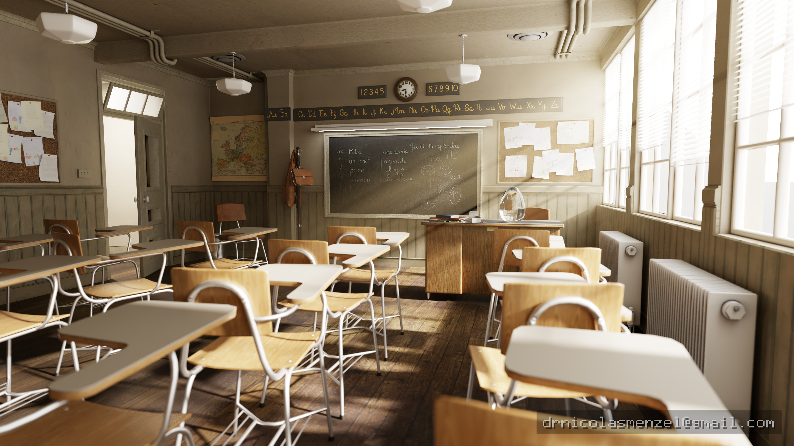

  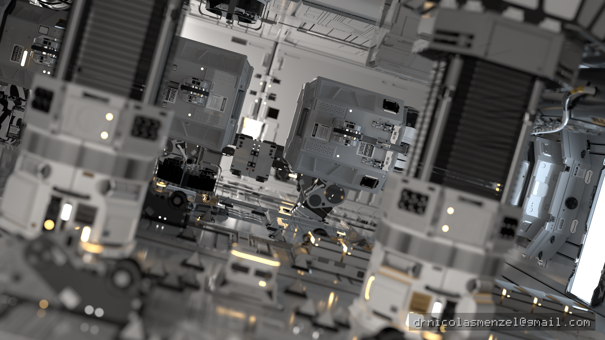

  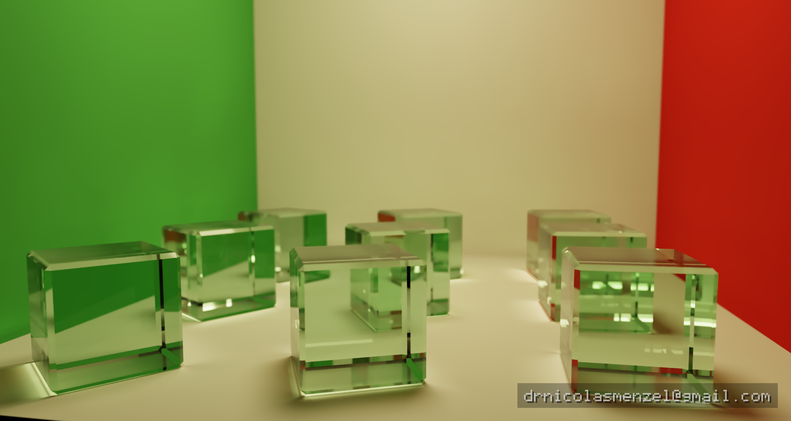

  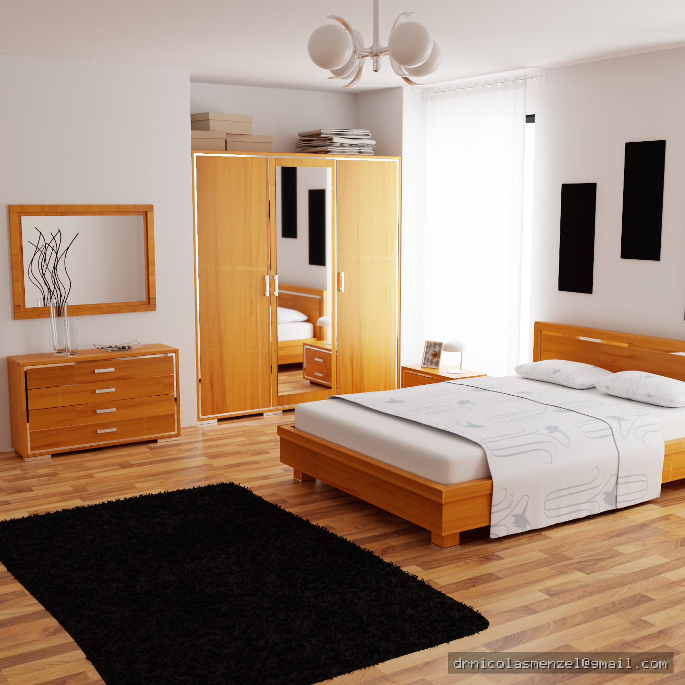
  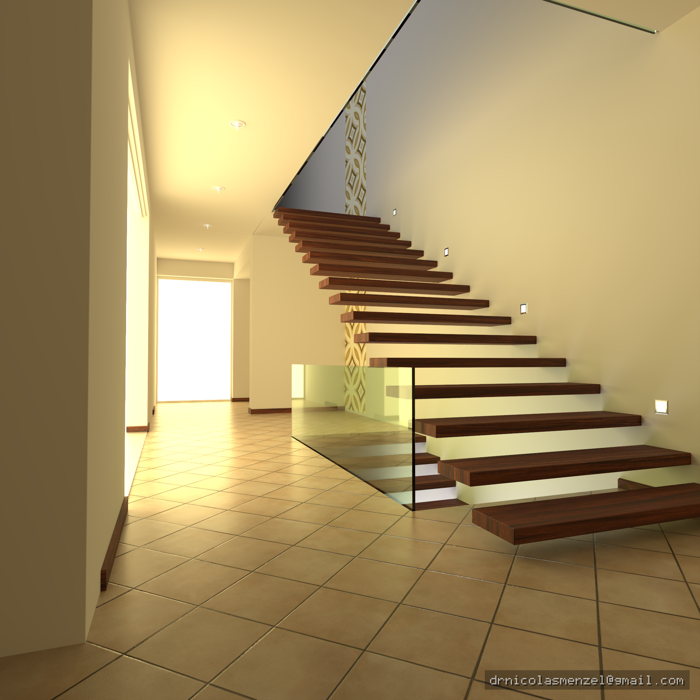

  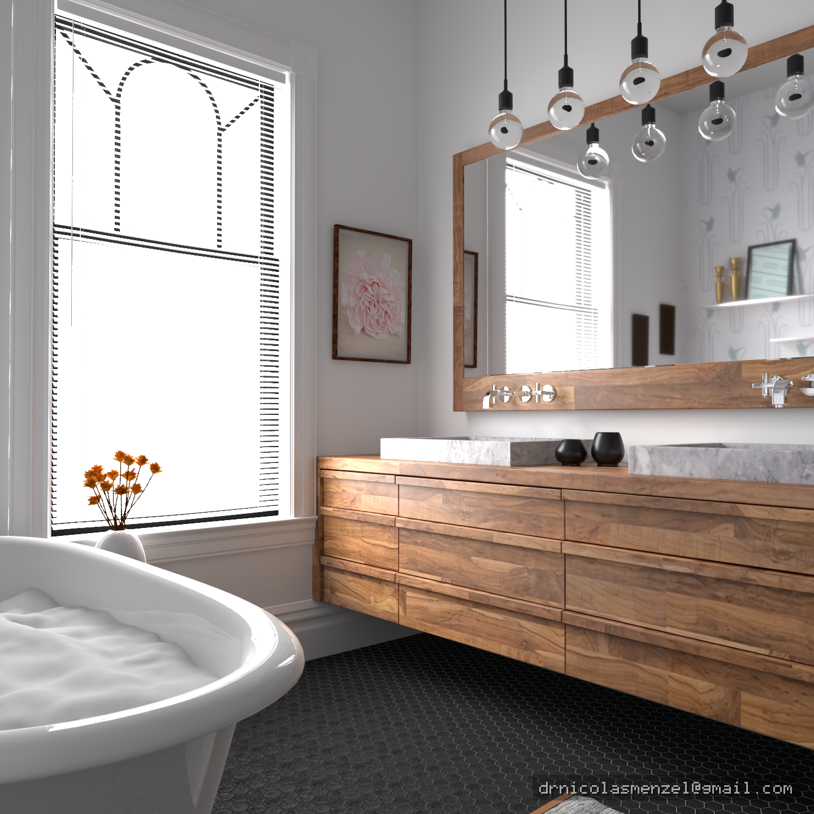
  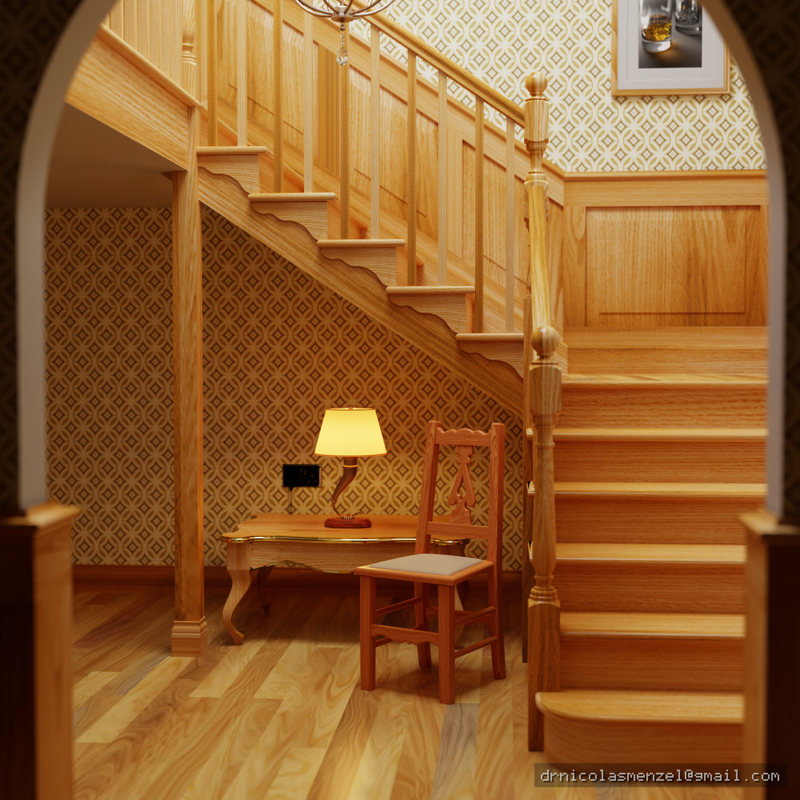

  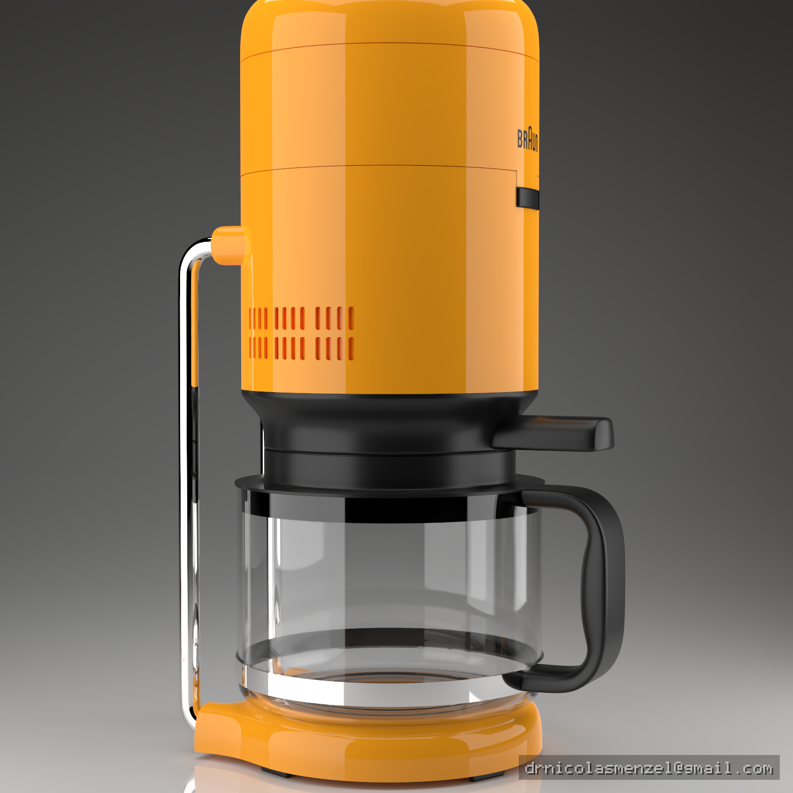
  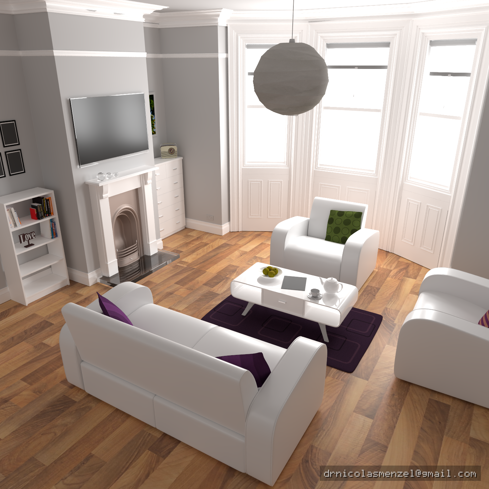

  Rendered with various test scenes from <a href="https://benedikt-bitterli.me/resources/">Rendering Resources</a> by Benedikt Bitterli (2016).
  This project also uses the <i>Classroom</i> scene from <a href="https://www.blender.org/download/demo-files/#cycles">Blender demo files</a>, authored by Christophe Seux.
  This project also uses the <i>Zero Day</i> scene from <a href="https://github.com/mmp/pbrt-v4-scenes?tab=readme-ov-file">pbrt-v4-scenes</a>, based on project files from <a href="https://www.beeple-crap.com/resources">Beeple's resources page</a> and originally authored by <a href="https://www.beeple-crap.com/about">Mike Winkelmann (Beeple)</a>.
  This repository includes the Cornell Box, Cornell Glass Boxes, Veach Bidir, Staircase, and Staircase 2 scenes; see <a href="CREDITS.md">credits</a> for bundled third-party scene attribution and license details.

  <b>Built by nicolasgfx</b> 
  Hobby graphics project developed in free time

  A GPU path tracer built as a personal hobby project to explore rendering ideas and learn by building them.

  Built on <b>NVIDIA OptiX 9</b> · <b>CUDA 12</b> · <b>C++17</b>

  <a href="#overview">Overview</a> •
  <a href="#at-a-glance">At a Glance</a> •
  <a href="#copilot-skills-workflow">Copilot Skills</a> •
  <a href="#technical-highlights">Technical Highlights</a> •
  <a href="#scenes">Scenes</a> •
  <a href="#caustics">Caustics</a> •
  <a href="#license">License</a>

---

## Overview

A physically based GPU path tracer built on OptiX and CUDA. It supports path tracing, an optional caustic pass for glass and mirror effects, PBRT v4 scene loading, and a built-in diagnostics workflow.

This is a hobby project. The goal is to explore rendering ideas, not to compete with commercial tools.

## At a Glance

- Path tracing with direct light sampling and multiple importance sampling
- 9 material types including glass, mirror, glossy metal, fabric, and more
- Glass and mirror caustics with color dispersion
- Loads PBRT v4, OBJ/MTL, and PLY scenes with textures and instancing
- Firefly filter, bloom, ACES tonemapping, and optional OptiX AI denoiser
- Analyze → render → diagnose workflow with convergence tracking
- Unit, integration, and convergence tests

## Copilot Skills Workflow

GitHub Copilot Skills are used to loop through: understand the scene, render, inspect the result, iterate.

  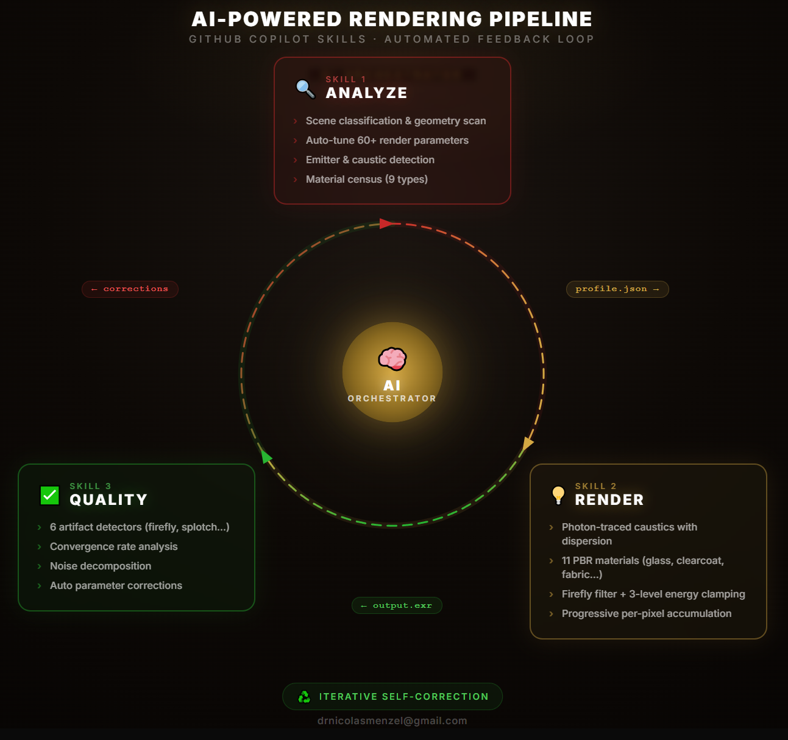

| Skill | What it does |
|---|---|
| **scene-analysis** | Understand the scene, suggest starting parameters |
| **orchestrator** | Connect the analyze → render → diagnose stages |
| **renderer** | Path tracing internals and energy conservation |
| **post-processing** | Firefly filter, bloom, tonemapping, denoiser |
| **quality** | Inspect artifacts and convergence |
| **test-harness** | Regression tests and statistical validation |
| **code-quality** | C++ / CUDA style conventions |

## Technical Highlights

| Area | What is implemented |
|---|---|
| **GPU / OptiX pipeline** | OptiX 9, CUDA 12, progressive accumulation, interactive viewer |
| **Light transport** | Path tracing, direct light sampling, emission MIS, Russian roulette |
| **Materials** | Lambertian, mirror, glass, glossy metal, glossy dielectric, clearcoat, fabric, translucent, diffuse transmission |
| **Microfacet model** | GGX with Smith masking-shadowing and VNDF sampling |
| **Caustics** | Forward light tracing through specular chains, stochastic dispersion, sensor projection |
| **Scene support** | PBRT v4, OBJ/MTL, PLY, textures, normal maps, bump maps, alpha, instancing |
| **Post-processing** | Firefly filter, OptiX denoiser, bloom, ACES tonemapping, EXR/PNG output |
| **Diagnostics** | Variance tracking, convergence analysis, bottleneck detection |
| **Testing** | Statistical tests, integration tests, convergence regressions |

## Scenes

The viewer ships with 4 built-in scenes, switchable with number keys:

| Key | Scene |
|---|---|
| **1** | Cornell Glass Boxes |
| **2** | Veach Bidir |
| **3** | Staircase |
| **4** | Staircase 2 |

## Caustics

Some light paths — like sunlight focused through curved glass onto a table — are nearly impossible for standard path tracing to find. The renderer has a separate caustic pass that traces light forward through glass and mirrors, then projects the result back onto the camera.

  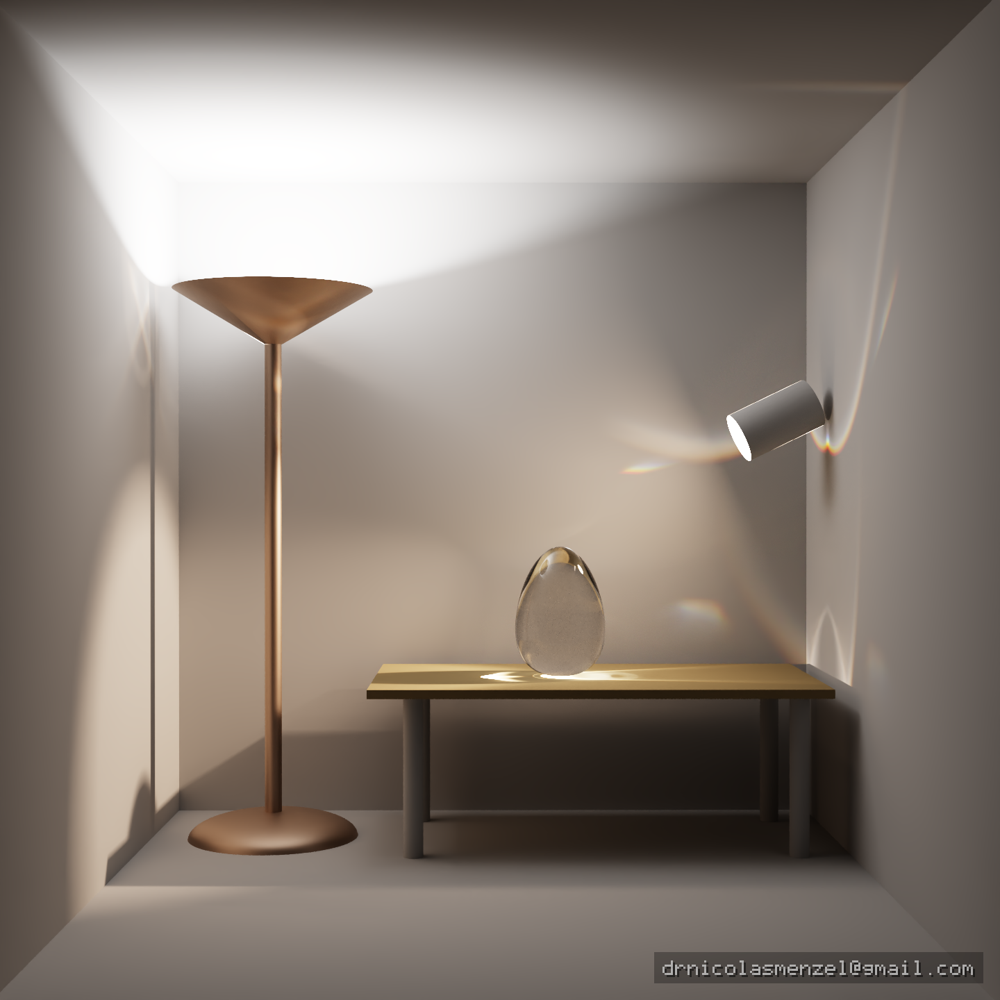
  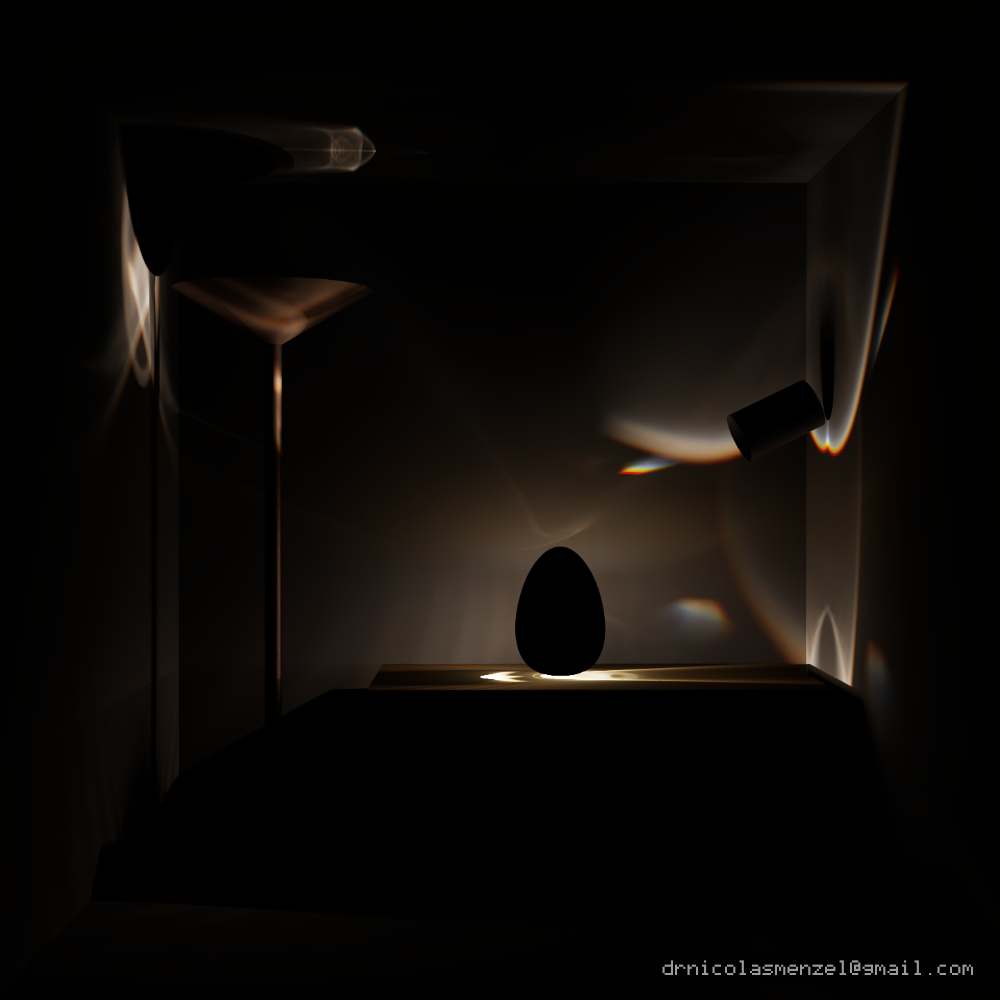

  Scenes where the dedicated caustic pass recovers focused light patterns, including the <i>Zero Day</i> scene from
  <a href="https://github.com/mmp/pbrt-v4-scenes?tab=readme-ov-file">pbrt-v4-scenes</a> by
  <a href="https://www.beeple-crap.com/about">Mike Winkelmann (Beeple)</a>, using source project files from <a href="https://www.beeple-crap.com/resources">Beeple's resources page</a>.

## License

MIT — see [LICENSE](LICENSE).

Copyright © 2026 nicolasgfx

Some gallery images use third-party scenes — see [CREDITS.md](CREDITS.md)
for full attribution, including the *Classroom* scene by
Christophe Seux and the *Zero Day* scene by
[Mike Winkelmann (Beeple)](https://www.beeple-crap.com/about), with original project files from Beeple's [resources page](https://www.beeple-crap.com/resources).
