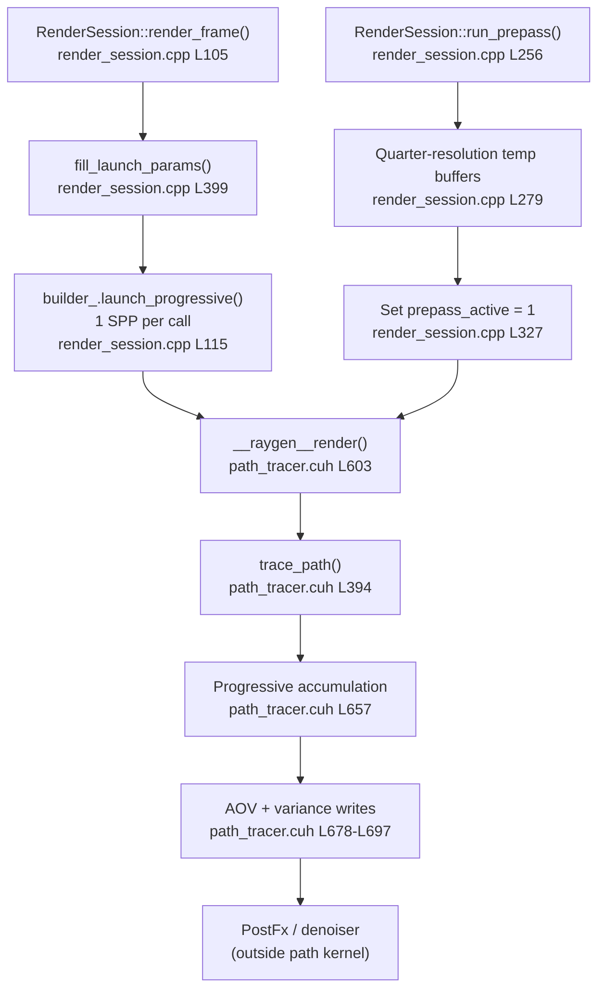
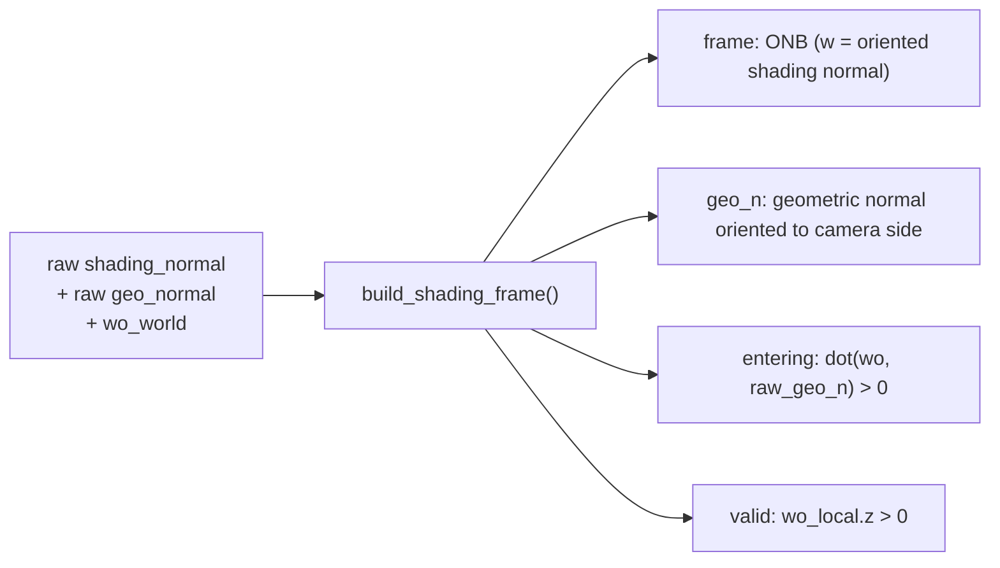
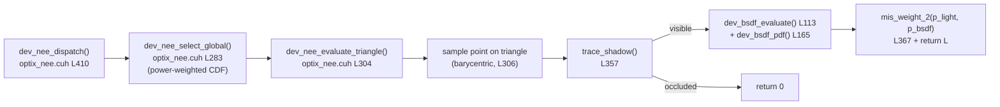
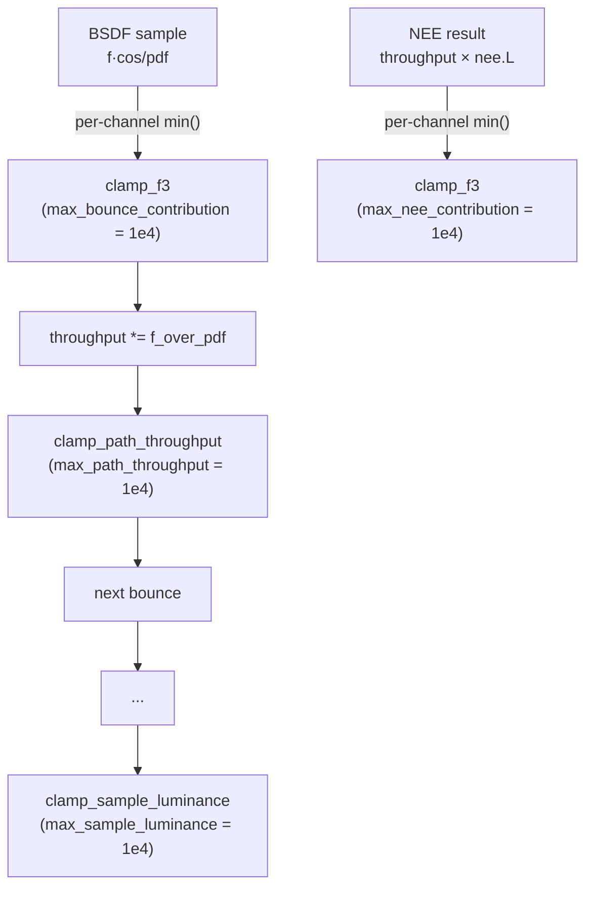
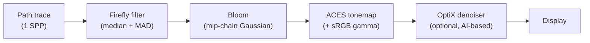

# Path Tracer Workflow Reference

Reference for the v5 camera-path integrator with code anchors to the active host and device source. Updated to reflect the ShadingFrame normal consolidation, shared BSDF helpers (`fresnel_schlick3`, `ggx_denom`, `bsdf_lobe_probabilities`), and the DiffuseTransmission material type (ID 9).

## Scope

Brute-force camera path tracing with:

- Triangle-emitter NEE with power-heuristic MIS ($\beta = 2$)
- Progressive 1 SPP/frame accumulation
- Pre-pass diagnostics (quarter-resolution variance analysis)
- GPU post-processing (firefly filter → bloom → ACES tonemap)
- Optional OptiX AI denoiser
- 10 material types including 3 delta BSDFs
- Four-level clamping (per-bounce NEE, per-bounce BSDF, per-path, per-sample)
- Russian roulette path termination (default start at bounce 3)

Not currently implemented: environment/infinite-light on camera-ray miss, participating media, photon tracing, SD-tree path guiding.

---

## 1. Pipeline Overview



### Coarse control flow

1. `RenderSession::render_frame()` at `render_session.cpp L105` rebuilds launch params, sets `samples_per_pixel = 1` (L381), launches OptiX (L115), and increments the accumulated SPP counter.
2. `fill_launch_params()` at `render_session.cpp L399` binds output buffers, camera basis, render limits, clamping parameters, geometry/material/light arrays, and pre-pass flags.
3. `__raygen__render()` at `path_tracer.cuh L603` traces `samples_per_pixel` camera paths per pixel, guards against NaN/Inf via `is_finite_f3()` (L636), updates pre-pass counters when active (L644), and writes progressive output (L657).
4. `trace_path()` at `path_tracer.cuh L394` runs the iterative bounce loop: intersection → normal/bump map → emissive-hit MIS → delta handling → non-delta NEE → BSDF continuation → throughput update → Russian roulette → final sample clamp.
5. Optional pre-pass `run_prepass()` at `render_session.cpp L256` launches a quarter-resolution diagnostic render and saves `output/prepass_variance.png` (L368) + `output/prepass_metrics.json` (L370).

---

## 2. Host Launch — `render_session.cpp`

| Function | Line | Purpose |
|---|---|---|
| `render_frame()` | L105 | Main per-frame entry: rebuild params, launch, accumulate |
| `run_prepass()` | L256 | Quarter-resolution diagnostic render |
| `fill_launch_params()` | L399 | Binds all GPU parameters for the frame |

### 2.1 Pre-pass

`run_prepass()` allocates temporary quarter-resolution colour and counter buffers (L279–L289), sets `prepass_active = 1` at L327, and runs `prepass_spp` iterations (L331). The kernel atomically increments total-path, bounce-sum, and zero-path counters. The host reads these back via `compute_prepass_metrics()` (L350) to compute `mean_luminance`, `max_luminance`, and `variance_ratio`, saved to `output/prepass_metrics.json` (L370).

### 2.2 Fill Launch Params

`fill_launch_params()` at L399 populates a `LaunchParams` struct (`launch_params.h`) with:

- Output buffer pointers: colour (float×3 SoA), albedo (float×4), normal (float×4), variance (lum_sum, lum_sum2)
- Camera: origin, basis vectors U/V/W
- Path limits: `max_bounces`, `min_bounces_rr`, `rr_threshold`
- Clamping: `clamping_enabled`, `max_bounce_contribution`, `max_nee_contribution`, `max_path_throughput`, `max_sample_luminance`
- Geometry: GAS handle, vertex/index/normal/uv/tangent arrays, material_ids
- Materials: per-material SoA arrays (Kd, Ks, Le, Tf, roughness, ior, mat_type, clearcoat, sheen, texture indices)
- Lights: `emissive_tri_indices[]`, `emissive_cdf[]`, `emissive_local_idx[]`, `num_emissive`
- Pre-pass: `prepass_active`, atomic counter pointers
- Render mode: `render_mode` (Full / IndirectOnly)

Uploaded once per frame via `optixLaunch()` parameter block.

---

## 3. OptiX Programs — `optix_programs.cu`

| Program | Line | Purpose |
|---|---|---|
| `__anyhit__radiance()` | L57 | Alpha-test radiance rays; stochastic opacity |
| `__anyhit__shadow()` | L80 | Alpha-test shadow rays; report hit or ignore |
| `__closesthit__radiance()` | L112 | Pack hit data into TraceResult payload |
| `__closesthit__shadow()` | L189 | Shadow closest-hit (no-op) |
| `__miss__radiance()` | L197 | Signal miss (`hit = false`) to `trace_path()` |
| `__miss__shadow()` | L204 | Record shadow ray miss (light is visible) |

### 3.1 Closest-Hit Payload

`__closesthit__radiance()` at L112 computes:
- Raw **geometric normal** (edge cross-product of the hit triangle, L128–L129)
- Interpolated **shading normal** (barycentric blend of per-vertex normals, L132–L135)
- UV coordinates (barycentric interpolation, L155–L161) and material index from SBT data

These are packed into a `TraceResult` struct via OptiX payload registers and returned to `trace_path()`. The downstream `ShadingFrame` construction (Section 4.2) handles all normal orientation.

### 3.2 Shadow Ray

Shadow rays use `OPTIX_RAY_FLAG_TERMINATE_ON_FIRST_HIT` (set in `optix_utils.cuh L93`) for early termination. `__anyhit__shadow()` (L80) performs alpha testing when an alpha texture is bound; below-threshold alpha calls `optixIgnoreIntersection()` (L92, L99), otherwise the hit is reported and the ray terminates.

---

## 4. Path Tracing Kernel — `path_tracer.cuh`

### 4.1 Entry Point — `__raygen__render()`

At L603. For each pixel in the launch grid:

```
for s in 0..samples_per_pixel:
    rng = PCGRng::seed(frame_number * 65537 + s * 104729 + 42,
                       pixel_idx + 1)
    direction = normalize(cam_w + cam_u*(2*u_ndc-1) + cam_v*(2*v_ndc-1))

    pr = trace_path(cam_pos, direction, rng)

    if !is_finite_f3(pr.radiance):          // L636: NaN/Inf guard
        pr.radiance = (0, 0, 0)

    if prepass_active:                       // L644: diagnostic counters
        atomicAdd(total_paths, 1)
        atomicAdd(bounce_sum, pr.num_bounces)
        if luminance(pr.radiance) <= 0:
            atomicAdd(zero_paths, 1)

// L657: progressive accumulation (SoA layout: color_r, color_g, color_b)
if frame_number == 0:
    color_r[px] = color.x; color_g[px] = color.y; color_b[px] = color.z
    sample_counts[px] = spp
else:
    w_old = old_count / (old_count + spp)
    w_new = spp / (old_count + spp)
    color_r[px] = color_r[px] * w_old + color.x * w_new  // etc.

// L678: AOV buffers (first frame only)
// L694: adaptive variance tracking (lum_sum, lum_sum2)
```

### 4.2 ShadingFrame — Normal Consolidation

All normal orientation, frame construction, and entering-detection are consolidated into the `ShadingFrame` struct at `types.h L125`. The factory `build_shading_frame()` at `types.h L141` performs five operations in one call:



Operations inside `build_shading_frame()`:
1. **Determine entering** — `dot(wo_world, raw_geo_normal) > 0`
2. **Orient geo_normal** toward camera — flip if `!entering`
3. **Orient shading_normal** to same hemisphere as geo_n — flip if they disagree
4. **Build ONB** from the oriented shading normal via `ONB::from_normal()` (`types.h L82`)
5. **Validate** — compute `wo_local` and check `wo_local.z > 0`

Every `trace_path()` branch (emissive-hit, delta, non-delta) calls this factory. No ad-hoc normal flipping exists outside it.

### 4.3 Bounce Loop — `trace_path()`

At L394. Full pseudocode of the iterative bounce loop:

```
trace_path(origin, direction, rng):
    throughput = (1, 1, 1)
    pdf_prev = 0          // 0 ⟹ previous was delta or camera ray
    L = (0, 0, 0)

    for bounce in 0..max_bounces:
        hit = trace_radiance(origin, direction)
        if !hit: break                                  // no envmap yet

        // ── Normal/bump map (L423) ───────────────────
        hit.shading_n = dev_apply_normal_map(...)
        hit.shading_n = dev_apply_bump_map(...)

        // ── Emissive hit (L429) ──────────────────────
        if hit.material == Emissive:
            sf = build_shading_frame(hit.shading_n, hit.geo_n, -direction)
            if dot(sf.geo_n, -direction) <= 0: break    // backface
            Le = dev_get_Le(hit.mat_id, hit.uv)
            if bounce == 0:                              // L441
                L += throughput * Le                     // camera ray: full weight
            else:                                        // L443
                w_bsdf = 1.0
                if pdf_prev > 0:                         // L445
                    p_nee = dev_light_pdf(tri_id, sf.geo_n, direction, hit.t, origin)
                    w_bsdf = mis_weight_2(pdf_prev, p_nee)  // power heuristic β=2
                L += throughput * Le * w_bsdf
            break

        // ── Delta surface (L457) ─────────────────────
        if dev_is_delta(hit.mat_id):
            sf = build_shading_frame(hit.shading_n, hit.geo_n, -direction)
            if !sf.valid: break
            wo_local = sf.wo_local(-direction)
            bs = dev_bsdf_sample(mat_id, wo_local, sf.entering, hit.uv, rng)
            if bs.pdf <= 0: break
            throughput *= bs.f * |bs.wi.z| / bs.pdf      // L479
            throughput = clamp_path_throughput(throughput) // L481
            // Offset: along geo_n, flipped for refraction
            origin = hit.pos + offset_n * PATH_EPSILON   // L487
            direction = sf.frame.local_to_world(bs.wi)
            pdf_prev = 0                                 // L489: delta → no MIS next hit
            continue

        // ── Non-delta surface (L493) ─────────────────
        sf = build_shading_frame(hit.shading_n, hit.geo_n, -direction)
        if !sf.valid: break
        wo_local = sf.wo_local(-direction)

        // NEE: 1 shadow ray (L508)
        if render_mode != IndirectOnly:
            nee = dev_nee_dispatch(hit.pos, sf.frame.w, sf.geo_n,
                                   sf.frame, wo_local, mat_id, hit.uv, rng)
            nee_contrib = throughput * nee.L
            nee_contrib = clamp_f3(nee_contrib, max_nee_contribution)  // L518
            L += nee_contrib

        // BSDF continuation (L522)
        bs = dev_bsdf_sample(mat_id, wo_local, hit.uv, rng)
        if bs.pdf < 1e-8 or bs.wi.z <= 0:
            // DiffuseTransmission: accept wi.z < 0 (transmission lobe)
            if mat_type == DiffuseTransmission and bs.wi.z < 0:
                transmitted = true
            else: break
        f_over_pdf[c] = min(bs.f[c] * |cos_theta_i| / bs.pdf, max_bounce_contribution)
        throughput *= f_over_pdf                         // L562
        throughput = clamp_path_throughput(throughput)    // L564

        // Russian roulette (L569)
        if bounce >= min_bounces_rr:
            max_tp = max_component(throughput)
            rr = russian_roulette(max_tp, rr_threshold, rng())
            if rr.terminate: break
            throughput *= rr.inv_survival
            throughput = clamp_path_throughput(throughput)

        // Prepare next ray (L580)
        origin = hit.pos + offset_n * PATH_EPSILON       // L584
        direction = wi_world
        pdf_prev = bs.pdf                                // L586

    // Per-sample luminance clamp (L590)
    L = clamp_sample_luminance(L, max_sample_luminance)
    return L
```

### 4.4 Emissive-Hit MIS

At L429. Three cases:

| Condition | MIS weight | Reason |
|---|---|---|
| `bounce == 0` (L441) | 1.0 | Camera ray — no competing NEE on previous bounce |
| `pdf_prev > 0` (L445) | $\frac{\text{pdf\_prev}^2}{\text{pdf\_prev}^2 + \text{p\_nee}^2}$ | Power heuristic balances BSDF vs light PDF |
| `pdf_prev == 0` | 1.0 | Post-delta — NEE was impossible, so full weight |

### 4.5 Delta Branch

At L457. For delta BSDFs (Mirror, Glass, Translucent):

- **No NEE** — a point-sampled direction has zero probability under light sampling
- `ShadingFrame` built and validated; `entering` flag used by Glass/Translucent for IOR
- Throughput update: `throughput *= f * |cosθ| / pdf` (L479); for Glass the stochastic Fresnel pdf ($F$ or $1 - F$) cancels the Fresnel factor in `f`, yielding energy-conserving transport
- Ray offset flips to the refraction side when `dot(wi_world, geo_n) < 0`
- `pdf_prev = 0` at L489 — ensures the next emissive hit gets full weight

### 4.6 NEE at Non-Delta Surfaces

At L508. One shadow ray per bounce:



Contribution clamped to `max_nee_contribution` (L518) before adding to radiance.

### 4.7 BSDF Continuation

At L522. After NEE, draw a continuation direction:

```
bs = dev_bsdf_sample(mat_id, wo_local, hit.uv, rng)
f_over_pdf[c] = min(bs.f[c] * |cos_theta_i| / bs.pdf, max_bounce_contribution)
throughput *= f_over_pdf
throughput = clamp_path_throughput(throughput, max_path_throughput)
```

DiffuseTransmission (type 9) accepts `wi.z < 0` — the transmitted ray starts on the opposite side of the surface (L580–L583). The `bs.pdf` is saved as `pdf_prev` (L586) for emissive-hit MIS on the next bounce.

### 4.8 Russian Roulette

At L569. After `min_bounces_rr` (default 3) bounces:

```
max_tp = max_component(throughput)           // types.h L76
rr = russian_roulette(max_tp, rr_threshold,  // russian_roulette.h L23
                      rng.next_float())
if rr.terminate: break
throughput *= rr.inv_survival                // unbiased compensation
throughput = clamp_path_throughput(throughput)
```

Starting at bounce 3 ensures direct + first-bounce indirect are always evaluated. The `rr_threshold = 0.95` cap prevents near-certain survival at high energies.

### 4.9 Final Sample Clamp

At L590. After the bounce loop exits:

```
L = clamp_sample_luminance(L, max_sample_luminance)   // sample_clamping.h L48
```

Uses `luminance()` (BT.709) to compute hue-preserving scale. This is the outermost of the four clamping levels.

---

## 5. NEE Internals — `optix_nee.cuh`

### 5.1 Material Accessors

All GPU-side material data access goes through `dev_get_*` accessor functions at L39–L106. Texture-mapped accessors (Kd, Ks, Le) accept a `float2 uv` parameter and multiply base colour by texture when a texture index is bound.

| Accessor | Line | Returns |
|---|---|---|
| `dev_get_Kd(mat_id, uv)` | L41 | Diffuse albedo (float3), texture-mapped |
| `dev_get_Ks(mat_id, uv)` | L51 | Specular reflectance (float3), texture-mapped |
| `dev_get_Le(mat_id, uv)` | L61 | Emission (float3), texture-mapped |
| `dev_get_alpha_tex(mat_id, uv)` | L71 | Alpha transparency (float) |
| `dev_get_Tf(mat_id)` | L80 | Glass transmission filter (float3) |
| `dev_get_roughness(mat_id)` | L86 | Surface roughness (float) |
| `dev_get_ior(mat_id)` | L91 | Index of refraction (float) |
| `dev_get_mat_type(mat_id)` | L96 | Material type enum (uint8_t) |
| `dev_is_clearcoat(mat_id)` | L101 | Clearcoat check (bool) |
| `dev_is_fabric(mat_id)` | L106 | Fabric check (bool) |
| `dev_is_thin(mat_id)` | L111 | Thin surface check (bool) |

No raw `params.Kd[...]` access outside these functions.

### 5.2 BSDF Evaluate and PDF

| Function | Line | Purpose |
|---|---|---|
| `dev_bsdf_evaluate()` | L113 | Evaluate $f(\omega_i, \omega_o)$ for a given direction pair |
| `dev_bsdf_pdf()` | L165 | Return the scalar PDF for a given direction pair |

These are the evaluation counterparts to `dev_bsdf_sample()` in `path_tracer.cuh`. They support all 10 material types (delta types return 0). Both functions use the shared helpers:

| Helper | Defined in | Purpose |
|---|---|---|
| `fresnel_schlick3(cos, f0)` | `bsdf_shared.h L36` | Per-channel metallic Fresnel |
| `ggx_denom(wo, wi)` | `bsdf_shared.h L117` | Cook-Torrance denominator $4 \lvert\omega_o \cdot n\rvert \lvert\omega_i \cdot n\rvert + \varepsilon$ |
| `bsdf_f0_from_ior(ior)` | `bsdf_shared.h L23` | Dielectric $F_0 = ((n-1)/(n+1))^2$ |
| `bsdf_lobe_probabilities(s, d)` | `bsdf_shared.h L68` | Lobe mixture weights, clamped to $[0.05, 0.95]$ |

### 5.3 Light PDF

`dev_light_pdf()` at L247. Converts area-measure triangle PDF to solid-angle:

$$p_\omega = p_{\text{tri}} \cdot \frac{1}{A} \cdot \frac{d^2}{\cos\theta_{\text{light}}}$$

where $p_{\text{tri}}$ is the power-weighted CDF probability for the triangle, $A$ is the triangle area, $d$ is the distance, and $\cos\theta_{\text{light}}$ is the cosine at the emitter. Used by both NEE and emissive-hit MIS.

### 5.4 Light Selection

`dev_nee_select_global()` at L283. Binary search over the emissive CDF (via `binary_search_cdf()` at L285) to pick a triangle light proportional to its total emissive power. Returns the local index and per-triangle probability.

### 5.5 Triangle Point Sampling

`dev_nee_evaluate_triangle()` at L304. Given a selected triangle:

```
bary = sample_triangle_dev(rng(), rng())              // L306: uniform barycentric
light_pos = v0*bary.x + v1*bary.y + v2*bary.z
light_normal = orient_to_shading_normal(cross(e1, e2))

wi = normalize(light_pos - hit_pos)
cos_receiver = dot(wi, shading_normal)
cos_emitter  = dot(-wi, light_normal)
if cos_receiver <= 0 or cos_emitter <= 0: return 0
if dot(wi, geo_normal) <= 0: return 0              // geometric backface cull

if !trace_shadow(hit_pos + geo_n * NEE_EPSILON, wi, dist):  // L357
    return 0                                        // occluded

f = dev_bsdf_evaluate(mat_id, wo_local, wi_local)
p_light = nee_pdf_area_to_solid_angle(p_tri, 1/area, dist², cos_emitter)
p_bsdf  = dev_bsdf_pdf(mat_id, wo_local, wi_local)
w_mis   = mis_weight_2(p_light, p_bsdf)             // L367: power heuristic β=2

L = w_mis * f * Le * cos_receiver / p_light
```

### 5.6 NEE Dispatch

`dev_nee_dispatch()` at L410:

1. Early-out if `num_emissive == 0`.
2. Pre-pass: atomically increment `prepass_nee_attempts` (L422).
3. Call `dev_nee_select_global()` → `dev_nee_evaluate_triangle()`.
4. Pre-pass: if visible, increment `prepass_nee_hits` (L427).
5. Return result (caller applies `max_nee_contribution` clamp at `path_tracer.cuh L518`).

---

## 6. BSDF Sampling — `dev_bsdf_sample()`

At `path_tracer.cuh L94`. Dispatches on the material type enum. All glossy lobes use shared centralized helpers from `bsdf_shared.h`.

### 6.1 Material Table

| ID | Type | Delta? | Sampling | BSDF |
|---|---|---|---|---|
| 0 | Lambertian | No | Cosine hemisphere | $f = K_d / \pi$ |
| 1 | Mirror | Yes | Perfect reflection | $f = K_s / \lvert\cos\theta\rvert$ (built-in $\delta$/pdf) |
| 2 | Glass | Yes | Stochastic Fresnel reflect/refract | Scalar IOR, colour $T_f$ filter, TIR fallback |
| 3 | GlossyMetal | No | Coin-flip: GGX VNDF vs cosine | Cook-Torrance, $K_s$ = Fresnel $F_0$ per-channel |
| 4 | Emissive | No | Cosine hemisphere | $f = K_d / \pi$ (emission added at hit) |
| 5 | GlossyDielectric | No | Coin-flip: GGX vs cosine | Scalar $F_0$ from IOR, energy-conserving blend |
| 6 | Translucent | Yes | Same as Glass + IOR stack | Nested dielectrics |
| 7 | Clearcoat | No | Coin-flip: coat GGX vs base | $f_{\text{base}} \times (1 - w \cdot F_r)$ attenuation |
| 8 | Fabric | No | Cosine (sheen is view-dependent) | $K_d / \pi + \text{sheen\_w} \cdot \text{tint} \cdot (1 - \cos\theta)^5 / \pi$ |
| 9 | DiffuseTransmission | No | Two-sided Lambert | $K_d / \pi$ reflect + $T_f / \pi$ transmit (`types.h L219`) |

### 6.2 Glossy Material Sampling (GlossyMetal / GlossyDielectric)

Both use the same structure, differing only in Fresnel (per-channel metallic vs scalar dielectric):

```
alpha = bsdf_roughness_to_alpha(roughness)           // max(roughness², 0.001)
lp = bsdf_lobe_probabilities(spec_weight, diff_weight)  // clamped [0.05, 0.95]

if rng() < lp.p_spec:
    h = ggx_sample_halfvector(wo, alpha, u1, u2)     // VNDF (Heitz 2014)
    wi = reflect(wo, h)
    if wi.z <= 0: reject
else:
    wi = sample_cosine_hemisphere(u1, u2)
    if wi.z <= 0: reject

// Combined PDF (both lobes, regardless of which sampled)
spec_pdf = ggx_D(h, alpha) * ggx_G1(wo, alpha) / (4 * |wo.z| + ε)
diff_pdf = cosine_hemisphere_pdf(wi.z)
pdf = lp.p_spec * spec_pdf + lp.p_diff * diff_pdf

// Evaluate full BSDF
denom = ggx_denom(wo, wi)                            // 4·|wo.z|·|wi.z| + ε
ndf = ggx_D(h, alpha)
geo = ggx_G(wo, wi, alpha)                           // Smith separable G

// GlossyMetal: per-channel Fresnel
F = fresnel_schlick3(VdotH, Ks)                      // Ks = F0 per channel
f = F * ndf * geo / denom + Kd / π

// GlossyDielectric: scalar Fresnel, energy-conserving blend
F0 = bsdf_f0_from_ior(ior)
Fr = fresnel_schlick(VdotH, F0)
f = Ks * (ndf * geo * Fr / denom) + Kd * (1 - Fr) / π
```

### 6.3 Convenience Overloads

| Function | Line | Signature | Purpose |
|---|---|---|---|
| Main overload | L94 | `dev_bsdf_sample(mat_id, wo, entering, uv, rng)` | Full version with explicit `entering` flag and UVs |
| Convenience | L376 | `dev_bsdf_sample(mat_id, wo, uv, rng)` | Infers `entering` from `wo.z > 0` |
| Delta check | L384 | `dev_is_delta(mat_id)` | Returns `true` for Mirror, Glass, Translucent |

### 6.4 Normal/Bump Map Application

At `path_tracer.cuh L31` and `L51`:
- `dev_apply_normal_map()` (L31) — perturbs shading normal using a tangent-space normal map
- `dev_apply_bump_map()` (L51) — perturbs shading normal via bump/displacement texture

Both are applied at L423–L427 of the bounce loop, before any shading computation.

---

## 7. Shared BSDF Helpers — `bsdf_shared.h`

Single source of truth for all BSDF math (186 lines), used by both `path_tracer.cuh` (sample) and `optix_nee.cuh` (evaluate/pdf). Also used by the CPU-side `bsdf.h`.

### 7.1 Fresnel

| Function | Line | Signature | Description |
|---|---|---|---|
| `fresnel_schlick` | L29 | `(float cos_theta, float f0) → float` | Scalar Schlick approximation |
| `fresnel_schlick3` | L36 | `(float cos_theta, float3 f0) → float3` | Per-channel metallic Fresnel |
| `fresnel_dielectric` | L47 | `(float cos_i, float eta) → float` | Exact dielectric Fresnel (with TIR) |

### 7.2 GGX Microfacet

| Function | Line | Description |
|---|---|---|
| `ggx_D(h, alpha)` | L91 | GGX NDF in local frame ($N = \hat z$) |
| `ggx_G1(v, alpha)` | L100 | Smith $G_1$ masking term |
| `ggx_G(wo, wi, alpha)` | L107 | Smith separable $G$ (masking-shadowing) |
| `ggx_denom(wo, wi)` | L117 | Cook-Torrance denominator: $4\lvert\omega_o \cdot n\rvert\lvert\omega_i \cdot n\rvert + \varepsilon$ |
| `ggx_sample_halfvector(wo, alpha, u1, u2)` | L122 | VNDF sampling (Heitz 2014) |

### 7.3 Lobe Probabilities

| Function | Line | Description |
|---|---|---|
| `LobeProbabilities` struct | L63 | `{p_spec, p_diff}` pair |
| `bsdf_lobe_probabilities(spec_w, diff_w)` | L68 | Returns `LobeProbabilities`, clamped $[0.05, 0.95]$ |
| `bsdf_metal_lobe_probs(Kd, Ks)` | L81 | Wrapper: weights from `max_component()` of each colour |
| `bsdf_dielectric_lobe_probs(Kd, Ks, ior)` | L85 | Wrapper: spec weight scaled by $F_0$ from IOR |

### 7.4 Other Helpers

| Function | Line | Description |
|---|---|---|
| `bsdf_roughness_to_alpha(roughness)` | L18 | $\max(\text{roughness}^2, 0.001)$ |
| `bsdf_f0_from_ior(ior)` | L23 | $((n-1)/(n+1))^2$ |
| `reflect_local(wo)` | L155 | Local-frame mirror reflection |
| `transmit_thin_local(wo)` | L160 | Local-frame thin-surface transmission |
| `refract_local(wo, eta, &wt)` | L164 | Local-frame refraction (returns `false` on TIR) |
| `mis_weight_2(pdf_a, pdf_b)` | L176 | Power-heuristic MIS: $a^2 / (a^2 + b^2)$ |
| `bsdf_combined_pdf(p_d, pdf_d, p_s, pdf_s)` | L183 | Mixture PDF: $p_d \cdot\text{pdf}_d + p_s \cdot\text{pdf}_s$ |

---

## 8. Core Utilities — `types.h` / `sample_clamping.h`

### 8.1 Float3 Reductions (`types.h`)

Canonical single-source functions used by all integrator code:

| Function | Line | Formula |
|---|---|---|
| `luminance(float3 v)` | L73 | BT.709: $0.2126 r + 0.7152 g + 0.0722 b$ |
| `max_component(float3 v)` | L76 | $\max(r, g, b)$ |
| `is_finite_f3(float3 v)` | L79 | `isfinite(x) && isfinite(y) && isfinite(z)` |

### 8.2 ShadingFrame (`types.h`)

| Item | Line | Description |
|---|---|---|
| `ONB` struct | L80 | Orthonormal basis with `from_normal()` (L82), `local_to_world()` (L91), `world_to_local()` (L95) |
| `onb_from_normal_and_tangent()` | L107 | Gram-Schmidt ONB for normal maps |
| `ShadingFrame` struct | L125 | `{frame, geo_n, entering, valid}` with `wo_local()` method (L120) |
| `build_shading_frame()` | L141 | Factory: 5-step orientation from raw normals + wo |

### 8.3 Clamping Functions (`sample_clamping.h`)

| Function | Line | Description |
|---|---|---|
| `clamp_f3(v, max_val)` | L19 | Per-channel cap: $\min(v_c, \text{max})$ |
| `clamp_bounce_contribution(f, limit)` | L25 | Per-channel cap on $f \cdot \cos / \text{pdf}$ |
| `clamp_path_throughput(tp, limit)` | L33 | Uniform scale-down if `max_component(tp) > limit` |
| `clamp_sample_luminance(L, limit)` | L48 | Hue-preserving scale if `luminance(L) > limit` |

---

## 9. Clamping Strategy

Four clamping levels prevent outlier energy from dominating the progressive average:



| Level | Function | When | Default | Config key |
|---|---|---|---|---|
| Per-bounce NEE | `clamp_f3()` | After NEE dispatch (L518) | 1e4 | `max_nee_contribution` |
| Per-bounce BSDF | `clamp_f3()` | After BSDF sample (L562) | 1e4 | `max_bounce_contribution` |
| Per-path throughput | `clamp_path_throughput()` | After each throughput update (L481, L564, L576) | 1e4 | `max_path_throughput` |
| Per-sample luminance | `clamp_sample_luminance()` | End of bounce loop (L590) | 1e4 | `max_sample_luminance` |

Defaults are in `config.h` (L60–L64). All four clamps are gated by `params.clamping_enabled` (default `true`, `config.h L60`). Current values are generous safety nets (~1e4); minimal bias but fireflies persist longer during interactive preview. Tighter values can be set per-scene via the JSON config.

---

## 10. Progressive Accumulation and Output

### 10.1 Accumulation

At `path_tracer.cuh L657` (SoA layout: `color_r`, `color_g`, `color_b`):

```
if frame_number == 0:
    color_r[px] = color.x; color_g[px] = color.y; color_b[px] = color.z
    sample_counts[px] = spp
else:
    w_old = old_count / (old_count + spp)
    w_new = spp / (old_count + spp)
    color_r[px] = color_r[px] * w_old + color.x * w_new
    // (same for color_g, color_b)
    sample_counts[px] = old_count + spp
```

This weighted-average form is numerically stable and avoids overflow for high SPP counts.

### 10.2 AOV Buffers

At L678 (first frame only), albedo and normal AOVs are written from the first non-specular hit recorded during `trace_path()`. Normal AOVs are at L685. These feed the OptiX AI denoiser.

### 10.3 Variance Tracking

At L694, per-pixel `lum_sum` and `lum_sum2` accumulators are updated (guarded by `if (params.lum_sum)`) for use by the firefly filter and quality diagnostics.

### 10.4 Post-Processing Chain

After the path tracing kernel, the host runs (in order):



Post-processing code lives in `src/renderer/postfx/`.

---

## 11. Renderer File Structure

```
src/
├── core/                             Fundamental types and config
│   ├── types.h                       float3 ops, ONB, ShadingFrame, luminance(), max_component()
│   ├── color.h                       Color3 struct (with luminance, max_component methods)
│   ├── config.h                      Compile-time defaults (bounces, clamp values, RR)
│   ├── camera.h                      Camera struct
│   ├── material_flags.h              MaterialType enum (10 types)
│   ├── device_buffer.h               CUDA device buffer wrapper
│   ├── random.h                      PCGRng random number generator
│   └── scene_profile.h               Scene classification data
│
└── renderer/
    ├── main.cpp                      Entry point: window, render loop, ImGui, keyboard
    ├── accel/                        Geometry & acceleration structures
    │   ├── accel_builder.h/.cpp      OptiX GAS/SBT/pipeline setup
    │   ├── optix_programs.cu         OptiX hit/miss/shadow programs (365 lines)
    │   ├── launch_params.h           LaunchParams struct (host↔device)
    │   ├── lighting_upload.h         Light data upload helpers
    │   └── optix_utils.cuh           Trace helpers, payload pack/unpack, shadow ray flags
    ├── app/                          Application framework
    │   ├── render_session.h/.cpp     Main rendering session (launch, prepass, accumulation)
    │   ├── render_config.h           Runtime configuration struct
    │   ├── render_config_json.cpp    JSON config serialization
    │   ├── viewer.h/.cpp             OpenGL display quad + ImGui overlay
    │   └── cli_args.h               Command-line argument parsing
    ├── integrator/                   Path tracing core (all GPU)
    │   ├── path_tracer.cuh           dev_bsdf_sample(), trace_path(), __raygen__render() (707 lines)
    │   ├── optix_nee.cuh             NEE: light selection, BSDF eval/pdf, triangle sampling (431 lines)
    │   ├── nee_shared.h              NEE shared types, epsilon, PDF conversions
    │   ├── caustic_tracer.cuh        Caustic light tracing kernel
    │   ├── sample_clamping.h         4-level clamping functions (54 lines)
    │   ├── russian_roulette.h        RR logic with configurable threshold
    │   └── path_state.h              PathResult, DevBSDFSample structs
    ├── lighting/                     Light acceleration
    │   ├── light_tree.h              Light BVH tree
    │   ├── light_tree_device.cuh     GPU light tree traversal
    │   └── light_tree_node.h         Light tree node struct
    ├── material/                     BSDF implementations
    │   ├── bsdf_shared.h             Fresnel, GGX, VNDF, lobe probs, MIS weight (CPU+GPU, 186 lines)
    │   ├── bsdf.h                    CPU-side BSDF sample/eval/pdf (all 10 types)
    │   └── specular.h                Glass/Mirror helpers
    ├── guide/                        SD-tree path guiding
    │   ├── sd_tree.h/.cpp            CPU-side SD-tree build/refine
    │   └── sd_tree_device.cuh        GPU-side SD-tree sample/pdf
    ├── photon/                       Photon system
    │   └── delta_surface.h           Delta surface detection helpers
    └── postfx/                       Post-processing pipeline
        ├── postfx_pipeline.h/.cpp    Pipeline orchestration
        ├── postfx_params.h           Post-FX parameter struct
        ├── firefly_filter.h/.cu      Median + MAD outlier rejection
        ├── bloom.h/.cu               Mip-chain Gaussian bloom
        ├── tonemap.h/.cu             ACES filmic tonemapper + sRGB gamma
        └── optix_denoiser.h/.cpp     OptiX AI denoiser wrapper
```

---

## 12. Tuning Notes

### 12.1 Bounce Limits

`max_bounces` (default 8, `config.h L50`) controls the absolute maximum path length. Almost all energy is captured within 6–8 bounces for typical scenes. Glass caustics may need the full budget.

### 12.2 Russian Roulette Tuning

Starting RR too early (e.g., bounce 1) introduces high variance in direct-lighting-dominated scenes. The default `min_bounces_rr = 3` (`config.h L51`) ensures direct + first-bounce indirect are always evaluated. The `rr_threshold = 0.95` (`config.h L52`) cap prevents near-certain survival at high throughputs.

### 12.3 Clamping Trade-offs

Higher clamp values → less bias but slower convergence (fireflies persist). Lower values → faster visual convergence but transport is technically biased. The current defaults (~1e4) are generous safety nets. The per-path throughput clamp is applied after *every* throughput update (delta, BSDF continuation, and RR compensation) to catch compound amplification.

### 12.4 Light Selection

The power-weighted CDF (`dev_nee_select_global()` at `optix_nee.cuh L283`) works well for most scenes. For scenes with hundreds of lights of varying intensity, hierarchical light sampling (light BVH in `src/renderer/lighting/`) would further reduce NEE variance.

### 12.5 Environment Light Gap

Camera rays that miss all geometry currently return black. Adding an environment map contribution in the miss branch of `trace_path()` and in `__miss__radiance()` (`optix_programs.cu L197`) would complete the light transport for outdoor scenes.

### 12.6 Glass and Specular Handling

Delta BSDFs bypass NEE entirely because their infinitely narrow PDF makes light sampling impossible ($\int_\Omega \delta(\omega - \omega_r)\,d\omega = 0$ for any finite-area light). Glass caustics are captured only through BSDF sampling, which can require many bounces. The clamping system prevents the resulting high-variance paths from causing fireflies.

### 12.7 Pre-pass Usage

The quarter-resolution pre-pass (`run_prepass()` at `render_session.cpp L256`) collects variance statistics (mean luminance, max luminance, zero-path ratio) that could auto-tune clamping or sampling parameters. Currently it only writes diagnostic files; adaptive feedback is not wired up.

### 12.8 Denoiser Integration

The OptiX AI denoiser (`src/renderer/postfx/optix_denoiser.h/.cpp`) runs as a post-process using albedo and normal AOVs. Most effective at low SPP (1–8); should be disabled for reference renders to avoid masking convergence issues.
